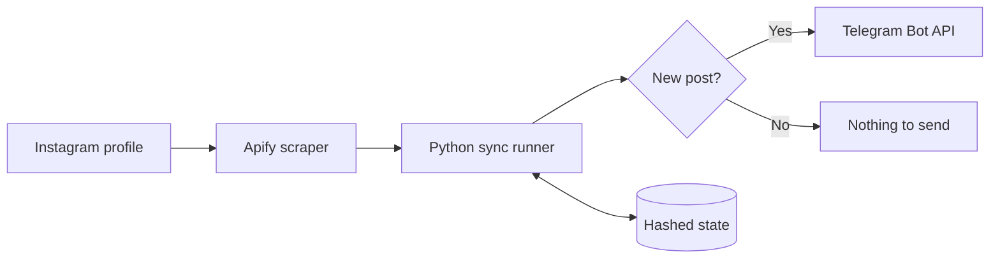

<div align="center">

<p>
  
  &nbsp;&nbsp;&nbsp;➜&nbsp;&nbsp;&nbsp;
  
  &nbsp;&nbsp;&nbsp;➜&nbsp;&nbsp;&nbsp;
  
</p>

# Instagram → Telegram

**Automatically repost new Instagram posts to Telegram with GitHub Actions.**

No server to maintain. No Instagram password. Four repository settings for the default deployment.

[](https://github.com/Bl0ck154/instagram-to-telegram/actions/workflows/instagram-to-telegram.yml)


</div>

---

## ✨ What it does

This project checks one Instagram profile every 6 hours, detects posts that have not been processed yet, downloads their media through Apify, and sends them to a Telegram channel or chat.

The normal hosted setup runs entirely on **GitHub Actions** and needs only four repository values.



## 🚀 Setup in 5 minutes

Open **Settings → Secrets and variables → Actions** in your repository.

### Variables

These are ordinary configuration values, not credentials.

| Name | Example | Purpose |
| --- | --- | --- |
| `INSTAGRAM_USERNAME` | `some_public_profile` | Instagram profile to monitor |
| `TELEGRAM_CHAT_ID` | `@my_channel` | Telegram destination |

### Secrets

These grant API access, so keep them private.

| Name | Where to get it | Purpose |
| --- | --- | --- |
| `TELEGRAM_BOT_TOKEN` | [@BotFather](https://t.me/BotFather) | Sends posts to Telegram |
| `APIFY_TOKEN` | Apify Console → Settings → Integrations | Reads Instagram posts through Apify |

> **That is the complete default setup.** You do not need Telegram API ID/hash, a Telethon session, browser cookies, proxies, a separate HMAC key, or an enable switch.

### First run

1. Add the two Variables and two Secrets above.
2. Add your Telegram bot to the destination channel/chat and allow it to post.
3. Open **Actions → Instagram to Telegram → Run workflow**.
4. Enable **`initialize_only`** and run it once.
5. Done — scheduled checks will run every 6 hours.

`initialize_only` records the posts that already exist without sending them, preventing an initial flood of old posts.

## 🧩 Default stack

<table>
<tr>
<td align="center" width="25%"><br><b>Instagram</b><br><sub>Source profile</sub></td>
<td align="center" width="25%"><br><b>Apify</b><br><sub>Post extraction</sub></td>
<td align="center" width="25%"><br><b>GitHub Actions</b><br><sub>Scheduler & runtime</sub></td>
<td align="center" width="25%"><br><b>Telegram</b><br><sub>Bot API delivery</sub></td>
</tr>
</table>

The default configuration uses:

- **Apify Instagram Scraper** as the Instagram backend.
- **Telegram Bot API** for delivery.
- A **6-post check window**, which also helps get past pinned posts.
- A **6-hour GitHub Actions schedule**.
- A local **Apify safety cap of 1800 results per billing cycle**.
- Billing-cycle tracking starting on **day 26** by default.

These operational defaults live in [`config.example.yml`](config.example.yml) and are not credentials.

## ⚡ Lightweight by default

The normal Apify → Telegram deployment does not load the experimental backends at all.

`requirements.txt` contains only the two direct runtime dependencies:

```text
PyYAML
requests
```

The CLI routes the default `apify` backend through a dedicated lightweight runner (`insta_tg_sync/apify_sync.py`). Playwright, Telethon, Instaloader and `curl_cffi` are not installed by the production GitHub Actions job.

That keeps scheduled runs smaller, faster to install, and easier to reason about.

## 🛡️ Privacy by design

The repository is intended to stay safe when public.

- API credentials live only in **GitHub Secrets**.
- Instagram username and Telegram destination are runtime **Variables**, not hardcoded into source files.
- Raw Instagram post shortcodes are not persisted in `data/state.json`; state identifiers are stored as keyed HMAC-SHA256 values.
- Runtime output redacts configured usernames, Telegram destinations, tokens, proxy URLs, API hashes, and detected Instagram shortcodes.
- Browser sessions, `.env` files, downloaded media, debug data, and local credentials are excluded by `.gitignore`.

The default deployment derives the internal state-hashing key from an existing credential, so there is no fifth secret to configure.

## 🔁 Duplicate protection

`data/state.json` tracks which posts have already been handled. A successful scheduled run updates this file through `github-actions[bot]` so the next run knows what it has already seen.

The state file may also contain non-sensitive numeric Apify usage counters used by the local safety cap.

## 🧪 Manual controls

The workflow exposes two useful switches when launched manually:

| Option | Effect |
| --- | --- |
| `initialize_only` | Mark currently visible posts as processed without sending them |
| `dry_run` | Fetch/download/check posts without posting to Telegram |

Pushes run the test suite only. Production synchronization runs on the schedule or through a manual workflow run.

## 💻 Local development

```bash
python -m venv .venv
python -m pip install -r requirements-dev.txt
```

Set the same four values as environment variables, then run:

```bash
python -m insta_tg_sync.cli --config config.example.yml
```

Validate configuration without contacting Instagram:

```bash
python -m insta_tg_sync.cli --config config.example.yml --validate
```

Run tests:

```bash
python -m pytest -q
```

## 🧰 Advanced backends

The repository still contains the older experimental/fallback backends: `curl_cffi`, Instaloader, Playwright browser mode, and Telethon.

They are **not required by the default GitHub Actions deployment**. If you intentionally want to use them locally, install the optional dependency set:

```bash
python -m pip install -r requirements-advanced.txt
```

For Playwright browser mode, install Chromium as well:

```bash
python -m playwright install chromium
```

Then select an alternative backend with `--backend`.

## ❓ FAQ

<details>
<summary><b>Do I need my Instagram password?</b></summary>

No. The default deployment reads the configured public profile through Apify.

</details>

<details>
<summary><b>Will it repost all old Instagram posts after installation?</b></summary>

No, if you run the first manual workflow with `initialize_only` enabled. A completely fresh account state also has an initial-baseline safeguard.

</details>

<details>
<summary><b>Why is my Telegram channel ID not a Secret?</b></summary>

Because it is configuration, not an authentication credential. Knowing a channel username or numeric destination ID does not grant the ability to post there. The bot token is the credential and remains a Secret.

</details>

<details>
<summary><b>Can I use a private Instagram account?</b></summary>

The default public setup is designed around profiles that the configured Apify actor can access without storing an Instagram login in this repository.

</details>

## 📁 Project structure

```text
.
├── .github/workflows/       # CI + scheduled synchronization
├── data/state.json          # Privacy-safe duplicate/usage state
├── insta_tg_sync/
│   ├── apify_sync.py        # Lightweight default runner
│   └── sync.py              # Optional/advanced backend runner
├── tests/                   # Unit tests
├── config.example.yml       # Public default configuration
├── requirements.txt         # Minimal production dependencies
├── requirements-dev.txt     # Test/development dependencies
└── requirements-advanced.txt# Optional backend dependencies
```

## 🔐 Security

Never commit real API tokens, sessions, cookies, proxy credentials, `.env` files, or downloaded private data. See [`SECURITY.md`](SECURITY.md) for reporting security problems.

## 📄 License

Released under the [MIT License](LICENSE).

---

<div align="center">
<sub>Built for a boring goal: post once on Instagram, get the same post in Telegram automatically.</sub>
</div>
